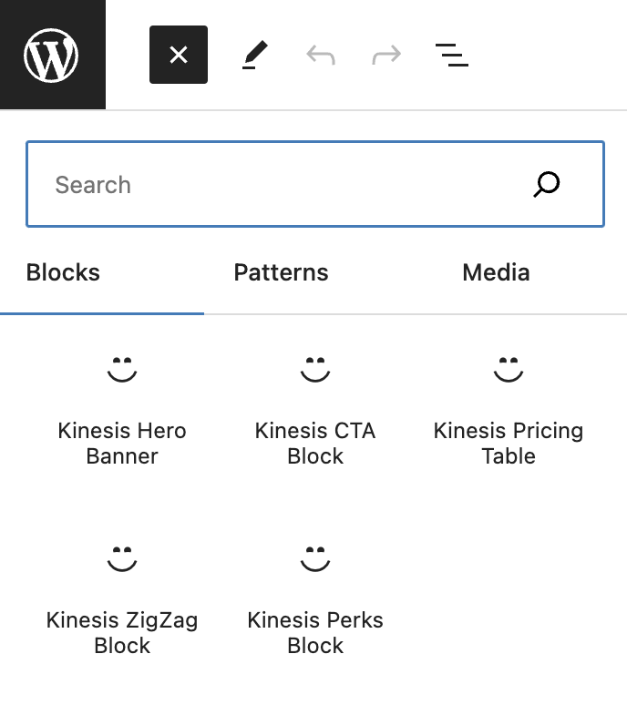

# Kinesis Plugin

This is a WordPress plugin that adds custom blocks and Tailwind CSS styling to your site.
This plugin developed using the tailpress plugin to fetch the `Tailwind CSS styling`.

## Important Note

This is a basic starter plugin that allows to create custom blocks, but requires further development before it is ready for use.

## Description

The Kinesis plugin provides the following:

- Tailwind CSS framework loaded for styling
- Custom Gutenberg blocks can be found in `src/components/`:
  - Hero banner
  - Call to action (CTA)
  - Pricing table
  - Zigzag section
  - Perks section
- Custom styling for the blocks using Tailwind utilities `css/kinesisStyle.css`

## Usage

After installing and activating the plugin:

1. Edit a page or post in the block editor
2. Add any of the custom blocks from the inserter
3. Customize the content and styling using the block controls
4. Publish and view the front-end to see the styled blocks

The Hero banner block can be used at the top of pages as an eye-catching header.

The Pricing table block lets you showcase latest crypto prices.

The Zigzag and Perks blocks help you create sectioned content with images and text.

The CTA block allows you to easily add a call to action button.

Utilize these new blocks along with Tailwind classes to build beautiful pages!

## Installation

1. Upload the plugin `/wp-content/plugins/` directory
2. Activate the plugin through the Plugins screen in WordPress
3. Use the blocks when editing pages and posts!

## Customization

The blocks can be modified by editing the React components in the `src/components` folder.
Additional css styles can be added in `css/kinesisStyle.css`.

## Developer

This plugin was created by [Abbas Yusuf](https://github.com/abbasyusuf).
And inspired by freshbrewedweb - tailpress (Tailwind css)
